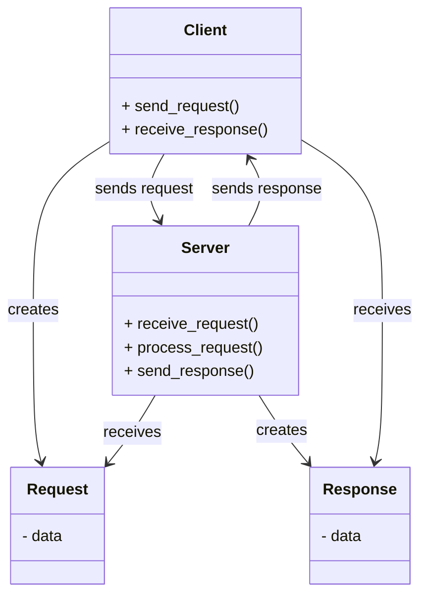

# Client-Server pattern
- The Server provides services or data.
- The Client requests those services.

## Common Use Cases
- Web servers & web browsers
- Database clients
- IoT devices communicating with a central server

## UML

