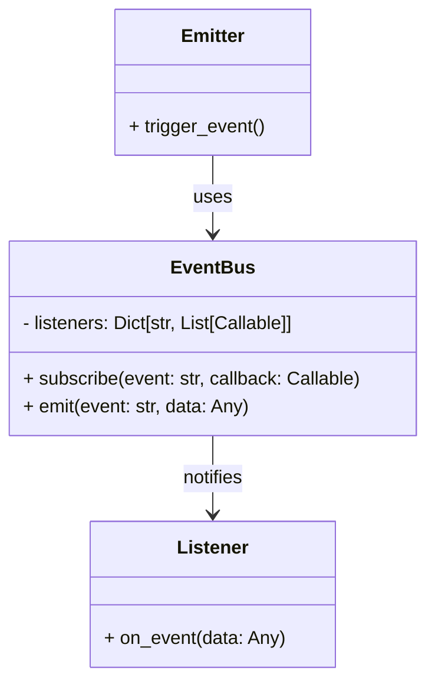

# Event-driven pattern

The Event-Driven Pattern is built around:
- Emitters that raise (emit) events.
- Listeners (handlers) that respond to those events.
- A dispatcher or event bus that connects them

## UML

