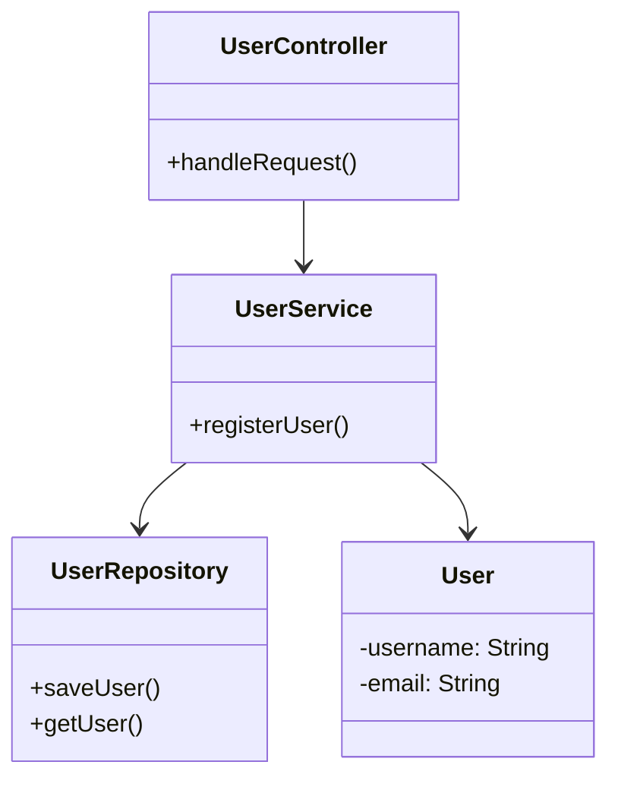

# Layered Architecture (n-tier) pattern

The Layered Architecture Pattern (also called n-tier) separates concerns into different layers, commonly:
- Presentation Layer – UI / input handling
- Application Layer – Orchestration logic
- Domain/Business Layer – Core logic/rules
- Data Access Layer – Interacts with database or storage

Each layer only depends on the one below it.

## UML

