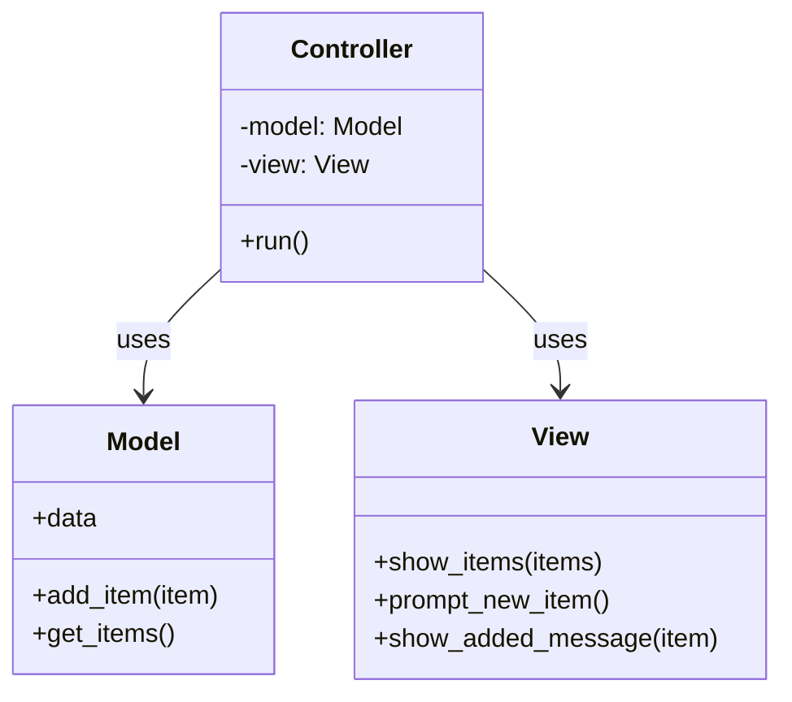

# Model-View-Controller (MVC) pattern

## MVC Structure Overview
| Layer          | Responsibility                                            |
| -------------- | --------------------------------------------------------- |
| **Model**      | Manages data, logic, and rules                            |
| **View**       | Handles output (UI, console, web, etc.)                   |
| **Controller** | Handles user input and coordinates between model and view |

## UML

