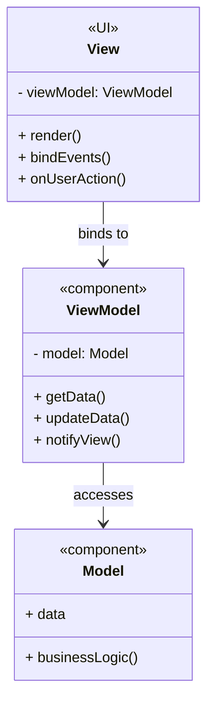

# MVVM (Model-View-ViewModel) pattern

## MVVM pattern overview
| Component     | Responsibility                           |
| ------------- | ---------------------------------------- |
| **Model**     | Manages the data and business rules.Holds data and business logic.      |
| **ViewModel** | Bridges model and view, handles state and user actions. Exposes data and operations to the View  |
| **View**      | UI definition, bound to the ViewModel. Displays UI and binds to ViewModel state |

## Why to use MVVM
| Feature          | Benefit                                   |
| ---------------- | ----------------------------------------- |
| **Decoupled UI** | UI logic is separated from business logic |
| **Testable VM**  | ViewModel can be tested without UI        |
| **Data Binding** | View reacts to ViewModel changes          |

## UML

