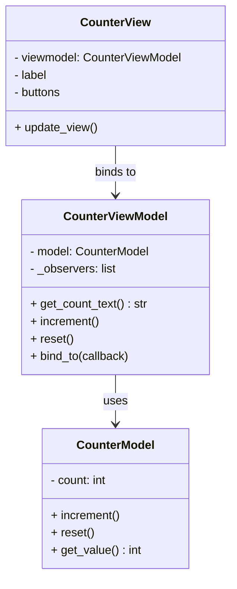

## What it does
- GUI starts with 0
- Clicking Increment calls ViewModel.increment(), updates Model, notifies View
- Clicking Reset resets counter in Model via ViewModel

## File overview
```
mvvm_example/
├── model.py
├── viewmodel.py
├── view.py
└── main.py
```

## UML

