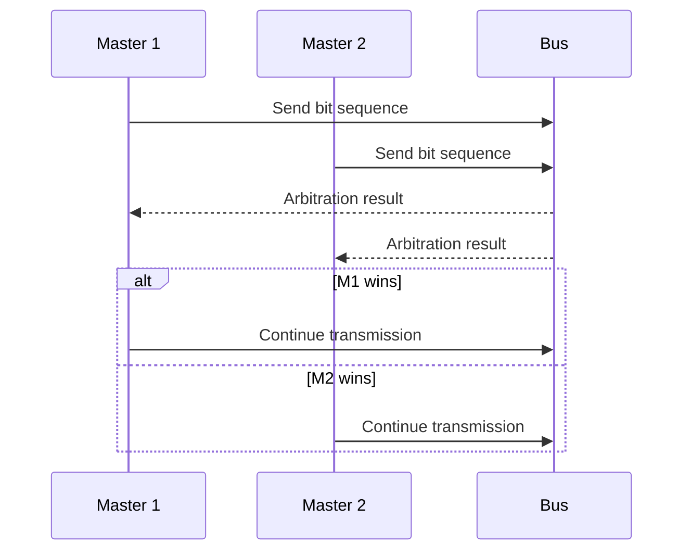

# Multi-master arbitration

## Scenario
Demonstrates how two masters might contend for an I2C-like bus:
- Two masters try to send data.
- Each bit sent is compared.
- If a master detects a discrepancy (tries to send 1 but sees 0 on the bus), it loses arbitration and stops transmitting.
- The master that successfully sends all bits first wins arbitration and continues transmission.

## UML

