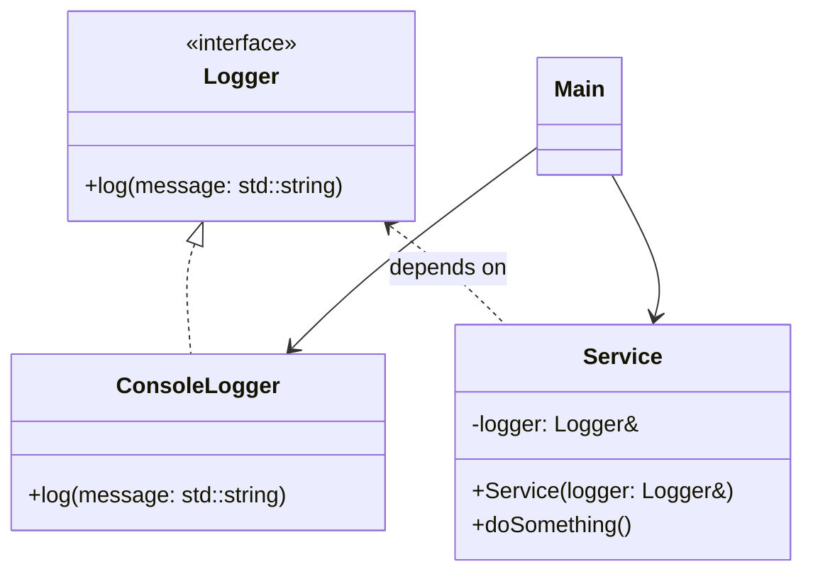
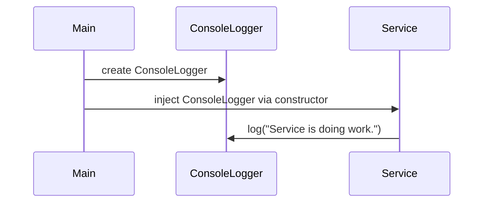

# Constructor Injection

| Feature        | Benefit                                         |
| -------------- | ----------------------------------------------- |
| Testability    | You can inject mocks or fakes                   |
| Loose coupling | Class depends on interface, not concrete        |
| Explicitness   | Required dependencies are clear at construction |
| Immutability   | No reassignment after construction              |

## UML

### Class diagram

### Sequence diagram
