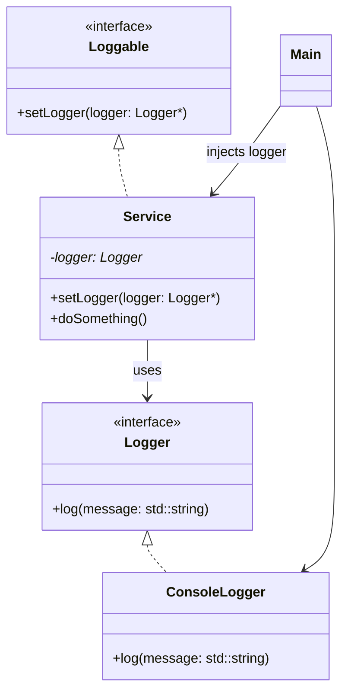

# Interface Injection

The dependency is injected via a method defined in an interface. The dependent object (e.g., Service) provides a method to accept the dependency.

- The dependent class declares a method (e.g., setLogger()) to accept a dependency.

- The injector calls this method to "inject" the required dependency.

- The injection happens after construction.

## Compile and Run
```
g++ main.cpp console_logger.cpp service.cpp -o app
```

## UML

- Logger is an abstract base class (interface).
- ConsoleLogger implements Logger.
- Loggable is another interface defining setLogger.
- Service implements Loggable and depends on Logger.
- Main instantiates everything and performs the injection.

