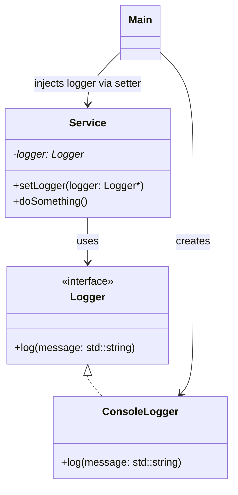

# Setter Injection

## When to use

- You want to create an object without immediately providing all dependencies.
- Some dependencies are optional or can change at runtime.

## UML



## Compile and Run

```
g++ main.cpp console_logger.cpp service.cpp -o app
```